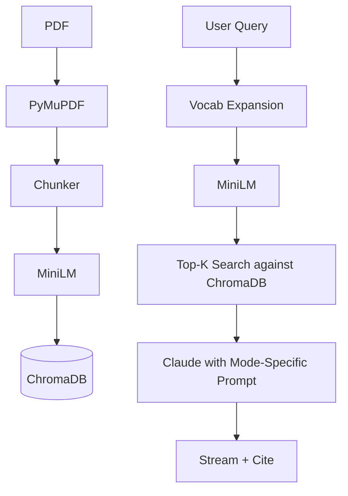

# UroAssist — AI Assistant for Urology Practice

> **UroAssist — AI Assistant for Urology Practice**
> A full-stack RAG system tailored for a urology clinic. Three modes: **Nurse Triage** over clinical guidelines (hematuria, BPH, stones), **Patient Intake** chatbot for plain-English pre-visit Q&A, and **Billing & Coding Helper** that suggests ICD-10 / CPT codes from clinical notes. Built with FastAPI, ChromaDB, and the Claude API. Features semantic search, streaming responses, page-level source citations, and a urology-specific vocabulary layer that expands lay terms to clinical terminology — mirroring the hybrid LLM + domain-knowledge architecture used in real specialty practice. The vocabulary layer is intentionally swappable: replace the dict, get a cardiology assistant.
> 
> **Stack:** Python · FastAPI · ChromaDB · Claude API · LangChain · PyMuPDF · Streamlit · Sentence-Transformers

## Demo


## Why Urology-Specific?

Specialty RAG models often fail when patients use lay language that does not match the clinical guidelines. For instance, a patient says "blood in urine" but the guidelines discuss "hematuria". UroAssist includes an architectural differentiator: a **urology vocabulary layer** that expands lay terms to clinical terminology *before* embedding and retrieval. 

This hybrid architecture (LLM + explicit domain knowledge) ensures maximum semantic overlap with the retrieved clinical guidelines. Furthermore, it is fully swappable: replace the dictionary, and the system can serve cardiology, orthopedics, or any other specialty.

## Quickstart

```bash
pip install -r requirements.txt
cp .env.example .env       # then add your ANTHROPIC_API_KEY
python scripts/seed_demo.py
uvicorn backend.main:app --reload    # terminal 1
streamlit run app.py                  # terminal 2
```

## Architecture



## Tech Stack

| Component | Technology |
|---|---|
| **Backend** | FastAPI, Uvicorn |
| **Frontend** | Streamlit |
| **LLM** | Anthropic Claude (claude-sonnet-4-5) |
| **Embeddings** | sentence-transformers (all-MiniLM-L6-v2) |
| **Vector DB** | ChromaDB (persistent local) |
| **Data Parsing** | PyMuPDF, LangChain Text Splitters |
| **Validation** | Pydantic v2 |

## Roadmap

- Telehealth platform integration (async men's health workflows)
- Patient chatbot embedded on practice website
- EMR integration (Epic / Athena)
- SNOMED CT urology subset for richer vocabulary expansion
- HIPAA considerations (audit logging, PHI redaction, BAA)
- Vocab layer swappable to other specialties (cardiology, orthopedics, etc.)

## License

MIT
